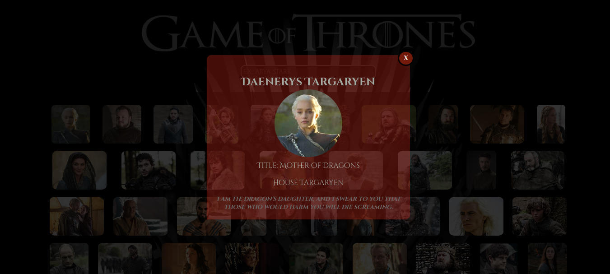

# Game Of Thrones
<p align="center"></p>
<h4 align="center"> Status do projeto: concluído.</h4>

### Tabela de conteudo

<p align="center">
<a href="#funcionalidades">funcionalidades</a> • 
<a href="#Demostração-da-Aplicação">Demostração</a> • 
<a href="#Como-executar-o-projeto">como Executar</a> • 
<a href="#Tecnologias-utilizadas">Tecnologias</a> •   
<a href="#autor">Autor</a> •
<a href="#licenc-a">Licença</a> 
</p>

### funcionalidades

- [x] Método fetch para fazer a busca da API;
- [x] Conectar as informações da api e fazer um filtro nas informações que serão exibidas;
- [x] Função que será utilizada para fazer a pesquisa dos personagens pelo usuário;
- [x] Modificação do html a partir da entrada de informações da API;
- [x] Função que selecionará a primeira frase do personagem e caso não exista, exibirá somente as informações da primeira API;
- [x] Condicionais que irão verificar a casa do personagem e modificar o background do modal para a cor da respectiva casa;
- [x] Evento para fechamento de modal;

### Demostração da Aplicação
* Escolher um personagem ou buscar pelo nome;
* Clicar;
* Visualizar as informações, foto, título, casa e frase;
* Sair do modal;
<a href="https://gotrones.netlify.app/">Teste o projeto</a>




### Como executar o projeto

Antes de começar, você vai precisar ter instalado em sua máquina as seguintes ferramentas:

Além disto é bom ter um editor para trabalhar com o código como [VSCode](https://code.visualstudio.com/)

```bash
# Clone este repositório
$ git clone <>

# Acesse a pasta do projeto no terminal/cmd
$ cd ...

# Execute a aplicação 
$ index.html ou server live(plugin do vscode)

```
            

### Tecnologias utilizadas

* JavaScript
* API
* SASS
* HTML

### Autor
Feito com ❤️ por Laihanne Campelo 👋🏽 Entre em contato!

email: laihanne.campelo@gmail.com

### Licença
MIT License
